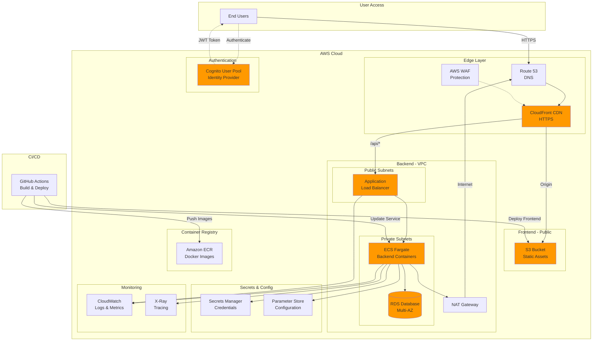
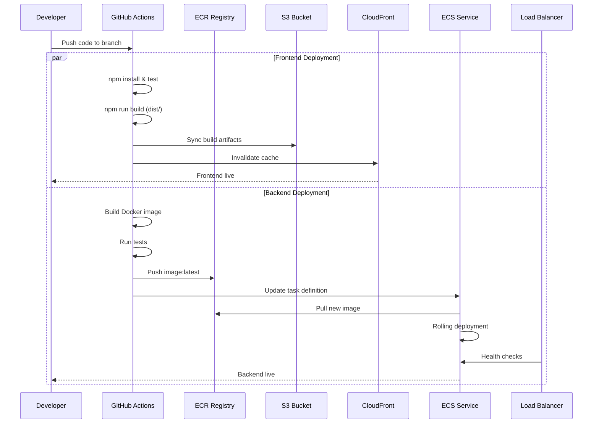

# AWS Deployment Guide
## Customer Workbench Application

**Document Version:** 1.0
**Last Updated:** December 2025

---

## Executive Summary

This guide provides a practical, production-ready AWS deployment architecture for the Customer Workbench application (React frontend + Spring Boot backend). The solution uses managed AWS services for minimal operational overhead, high availability, and automatic scaling.

**Key Services:**
- **Frontend:** S3 + CloudFront CDN
- **Authentication:** AWS Cognito
- **Backend:** ECS Fargate with Application Load Balancer
- **Database:** RDS (PostgreSQL/MySQL)
- **CI/CD:** GitHub Actions
- **Security:** ACM, WAF, Secrets Manager

**Deployment Time:** ~4-6 hours for full setup

---

## Architecture Diagram

### High-Level Architecture



### Deployment Flow



---

## Component Details

### 1. Frontend Hosting (S3 + CloudFront)

**S3 Static Website:**
- Store built React app (`dist/` folder)
- Enable versioning for rollback capability
- Block public access (CloudFront uses OAC)
- Cache-Control headers:
  - Hashed assets: `max-age=31536000, immutable`
  - `index.html`: `no-cache`

**CloudFront Distribution:**
- Global CDN with edge caching
- ACM SSL certificate (us-east-1)
- Custom domain: `app.example.com`
- Origin: S3 bucket via Origin Access Control
- Behaviors:
  - `/` → S3 (static files)
  - `/api/*` → ALB (backend API)
- Security: AWS WAF with OWASP rules

**Environment Configuration:**
```bash
# Build-time environment variable
VITE_API_URL=https://api.example.com/api
VITE_COGNITO_USER_POOL_ID=us-east-1_xxxxx
VITE_COGNITO_CLIENT_ID=xxxxx
```

### 2. Authentication (AWS Cognito)

**Cognito User Pool:**
- User registration and login
- Email/password authentication
- MFA support (optional)
- Custom attributes for customer data
- Password policies and account recovery

**Integration Points:**
- Frontend: AWS Amplify Auth library or Cognito SDK
- Backend: JWT token validation via Cognito public keys
- API: Protected routes require valid JWT tokens

**Setup Steps:**
1. Create Cognito User Pool
2. Configure app client (no secret for SPA)
3. Add custom attributes if needed
4. Configure token expiration (1 hour access, 30 days refresh)
5. Set up hosted UI or custom login page

### 3. Backend (ECS Fargate)

**Container Setup:**
- Docker image built from Spring Boot app
- Store in Amazon ECR
- Multi-stage build for smaller images
- Health check endpoint: `/actuator/health`

**ECS Configuration:**
- Fargate launch type (serverless containers)
- Task definition:
  - CPU: 512 (0.5 vCPU) or 1024 (1 vCPU)
  - Memory: 1 GB or 2 GB
  - Environment variables from Parameter Store
  - Secrets from Secrets Manager
- Service:
  - Desired count: 2 (min) - 10 (max)
  - Auto-scaling based on CPU/memory
  - Rolling deployment strategy
  - Private subnets only

**Application Load Balancer:**
- Public-facing HTTPS (port 443)
- ACM certificate for `api.example.com`
- Target group → ECS tasks
- Health check: `/actuator/health` every 30s
- Sticky sessions if needed

**Task IAM Role:**
```json
{
  "Effect": "Allow",
  "Action": [
    "secretsmanager:GetSecretValue",
    "ssm:GetParameter*",
    "logs:CreateLogStream",
    "logs:PutLogEvents"
  ],
  "Resource": "*"
}
```

### 4. Database (RDS)

**Configuration:**
- Engine: PostgreSQL 15 or MySQL 8
- Instance: db.t3.small (start) → db.r6g.large (production)
- Multi-AZ deployment for HA
- Automated backups (7-day retention)
- Encryption at rest (KMS)
- Private subnets only

**Security Group:**
- Allow inbound 5432/3306 from ECS security group only
- No public access

**Connection:**
- Credentials stored in Secrets Manager
- ECS tasks retrieve at startup
- Connection pooling in application

### 5. Networking (VPC)

**VPC Structure:**
- 3 Availability Zones
- Public subnets: ALB, NAT Gateway
- Private subnets: ECS tasks, RDS
- Internet Gateway for public subnets
- NAT Gateway for private subnet outbound access

**CIDR Example:**
- VPC: `10.0.0.0/16`
- Public subnets: `10.0.1.0/24`, `10.0.2.0/24`, `10.0.3.0/24`
- Private subnets: `10.0.11.0/24`, `10.0.12.0/24`, `10.0.13.0/24`

---

## Deployment Steps

### Phase 1: Network & Security (1-2 hours)

1. **Create VPC:**
   ```bash
   aws ec2 create-vpc --cidr-block 10.0.0.0/16 --tag-specifications 'ResourceType=vpc,Tags=[{Key=Name,Value=workbench-vpc}]'
   ```

2. **Create Subnets** (3 public + 3 private across AZs)

3. **Set Up Internet Gateway & NAT Gateway**

4. **Configure Route Tables**

5. **Request ACM Certificates:**
   - `app.example.com` (us-east-1 for CloudFront)
   - `api.example.com` (application region for ALB)

6. **Create Security Groups:**
   - ALB-SG: Allow 443 from 0.0.0.0/0
   - ECS-SG: Allow traffic from ALB-SG
   - RDS-SG: Allow 5432 from ECS-SG

### Phase 2: Database Setup (30 minutes)

1. **Create RDS Instance:**
   ```bash
   aws rds create-db-instance \
     --db-instance-identifier workbench-db \
     --db-instance-class db.t3.small \
     --engine postgres \
     --master-username admin \
     --master-user-password <generate-strong-password> \
     --allocated-storage 20 \
     --multi-az \
     --vpc-security-group-ids sg-xxxxx
   ```

2. **Store credentials in Secrets Manager:**
   ```bash
   aws secretsmanager create-secret \
     --name workbench/db-credentials \
     --secret-string '{"username":"admin","password":"xxxxx","host":"workbench-db.xxxxx.rds.amazonaws.com","port":"5432","dbname":"workbench"}'
   ```

### Phase 3: Backend Deployment (2 hours)

1. **Create ECR Repository:**
   ```bash
   aws ecr create-repository --repository-name customer-workbench-backend
   ```

2. **Build and Push Docker Image:**
   ```bash
   docker build -t customer-workbench-backend .
   docker tag customer-workbench-backend:latest <account-id>.dkr.ecr.<region>.amazonaws.com/customer-workbench-backend:latest
   aws ecr get-login-password | docker login --username AWS --password-stdin <account-id>.dkr.ecr.<region>.amazonaws.com
   docker push <account-id>.dkr.ecr.<region>.amazonaws.com/customer-workbench-backend:latest
   ```

3. **Create ECS Cluster:**
   ```bash
   aws ecs create-cluster --cluster-name workbench-cluster
   ```

4. **Create Application Load Balancer:**
   - Target group for ECS tasks
   - HTTPS listener with ACM certificate
   - Configure health checks

5. **Create ECS Task Definition** (see example below)

6. **Create ECS Service:**
   ```bash
   aws ecs create-service \
     --cluster workbench-cluster \
     --service-name backend-service \
     --task-definition backend-task \
     --desired-count 2 \
     --launch-type FARGATE \
     --network-configuration "awsvpcConfiguration={subnets=[subnet-xxx,subnet-yyy],securityGroups=[sg-xxx],assignPublicIp=DISABLED}" \
     --load-balancers "targetGroupArn=arn:aws:elasticloadbalancing:...,containerName=backend,containerPort=8080"
   ```

**Example Task Definition:**
```json
{
  "family": "backend-task",
  "networkMode": "awsvpc",
  "requiresCompatibilities": ["FARGATE"],
  "cpu": "512",
  "memory": "1024",
  "taskRoleArn": "arn:aws:iam::account-id:role/ecsTaskRole",
  "executionRoleArn": "arn:aws:iam::account-id:role/ecsTaskExecutionRole",
  "containerDefinitions": [
    {
      "name": "backend",
      "image": "<account-id>.dkr.ecr.<region>.amazonaws.com/customer-workbench-backend:latest",
      "portMappings": [{"containerPort": 8080, "protocol": "tcp"}],
      "essential": true,
      "environment": [
        {"name": "SPRING_PROFILES_ACTIVE", "value": "production"}
      ],
      "secrets": [
        {
          "name": "DB_PASSWORD",
          "valueFrom": "arn:aws:secretsmanager:region:account-id:secret:workbench/db-credentials:password::"
        }
      ],
      "logConfiguration": {
        "logDriver": "awslogs",
        "options": {
          "awslogs-group": "/ecs/backend",
          "awslogs-region": "us-east-1",
          "awslogs-stream-prefix": "ecs"
        }
      },
      "healthCheck": {
        "command": ["CMD-SHELL", "curl -f http://localhost:8080/actuator/health || exit 1"],
        "interval": 30,
        "timeout": 5,
        "retries": 3
      }
    }
  ]
}
```

### Phase 4: Frontend Deployment (1 hour)

1. **Create S3 Bucket:**
   ```bash
   aws s3 mb s3://workbench-frontend-prod
   aws s3api put-bucket-versioning --bucket workbench-frontend-prod --versioning-configuration Status=Enabled
   ```

2. **Create CloudFront Distribution:**
   - Origin: S3 bucket with OAC
   - Custom domain: `app.example.com`
   - SSL certificate from ACM (us-east-1)
   - Default behavior: cache static assets
   - Custom behavior `/api/*`: forward to ALB origin
   - Error pages: redirect 404 → index.html (SPA routing)

3. **Build and Deploy:**
   ```bash
   export VITE_API_URL=https://api.example.com/api
   npm run build
   aws s3 sync dist/ s3://workbench-frontend-prod --delete \
     --cache-control "max-age=31536000,public,immutable" \
     --exclude "index.html"
   aws s3 cp dist/index.html s3://workbench-frontend-prod/index.html \
     --cache-control "no-cache"
   aws cloudfront create-invalidation --distribution-id E1234567890ABC --paths "/*"
   ```

4. **Update Route 53:**
   ```bash
   # Create ALIAS record pointing app.example.com to CloudFront
   # Create ALIAS record pointing api.example.com to ALB
   ```

### Phase 5: Cognito Setup (30 minutes)

1. **Create User Pool:**
   ```bash
   aws cognito-idp create-user-pool \
     --pool-name workbench-users \
     --policies "PasswordPolicy={MinimumLength=8,RequireUppercase=true,RequireLowercase=true,RequireNumbers=true}" \
     --auto-verified-attributes email
   ```

2. **Create App Client:**
   ```bash
   aws cognito-idp create-user-pool-client \
     --user-pool-id us-east-1_xxxxx \
     --client-name workbench-web-app \
     --no-generate-secret \
     --explicit-auth-flows ALLOW_USER_SRP_AUTH ALLOW_REFRESH_TOKEN_AUTH
   ```

3. **Configure Frontend:**
   - Add environment variables for Cognito
   - Integrate AWS Amplify Auth library
   - Protect routes with authentication

4. **Configure Backend:**
   - Add Cognito JWT validation
   - Extract user claims from token
   - Protect API endpoints

---

## CI/CD Pipeline (GitHub Actions)

### Frontend Workflow

**.github/workflows/deploy-frontend.yml**
```yaml
name: Deploy Frontend

on:
  push:
    branches: [main]
    paths:
      - 'src/**'
      - 'public/**'
      - 'package.json'

permissions:
  id-token: write
  contents: read

jobs:
  deploy:
    runs-on: ubuntu-latest
    steps:
      - uses: actions/checkout@v4

      - name: Setup Node.js
        uses: actions/setup-node@v4
        with:
          node-version: '18'
          cache: 'npm'

      - name: Install dependencies
        run: npm ci

      - name: Run tests
        run: npm test

      - name: Configure AWS credentials
        uses: aws-actions/configure-aws-credentials@v4
        with:
          role-to-assume: arn:aws:iam::${{ secrets.AWS_ACCOUNT_ID }}:role/GitHubActionsDeployRole
          aws-region: us-east-1

      - name: Build application
        env:
          VITE_API_URL: ${{ secrets.VITE_API_URL }}
          VITE_COGNITO_USER_POOL_ID: ${{ secrets.COGNITO_USER_POOL_ID }}
          VITE_COGNITO_CLIENT_ID: ${{ secrets.COGNITO_CLIENT_ID }}
        run: npm run build

      - name: Deploy to S3
        run: |
          aws s3 sync dist/ s3://${{ secrets.S3_BUCKET }} --delete \
            --cache-control "max-age=31536000,public,immutable" \
            --exclude "index.html"
          aws s3 cp dist/index.html s3://${{ secrets.S3_BUCKET }}/index.html \
            --cache-control "no-cache"

      - name: Invalidate CloudFront
        run: |
          aws cloudfront create-invalidation \
            --distribution-id ${{ secrets.CLOUDFRONT_DISTRIBUTION_ID }} \
            --paths "/*"
```

### Backend Workflow

**.github/workflows/deploy-backend.yml**
```yaml
name: Deploy Backend

on:
  push:
    branches: [main]
    paths:
      - 'backend/**'

permissions:
  id-token: write
  contents: read

jobs:
  deploy:
    runs-on: ubuntu-latest
    steps:
      - uses: actions/checkout@v4

      - name: Set up JDK 17
        uses: actions/setup-java@v4
        with:
          java-version: '17'
          distribution: 'temurin'

      - name: Run tests
        run: ./mvnw test

      - name: Configure AWS credentials
        uses: aws-actions/configure-aws-credentials@v4
        with:
          role-to-assume: arn:aws:iam::${{ secrets.AWS_ACCOUNT_ID }}:role/GitHubActionsDeployRole
          aws-region: us-east-1

      - name: Login to Amazon ECR
        id: login-ecr
        uses: aws-actions/amazon-ecr-login@v2

      - name: Build and push Docker image
        env:
          ECR_REGISTRY: ${{ steps.login-ecr.outputs.registry }}
          ECR_REPOSITORY: customer-workbench-backend
          IMAGE_TAG: ${{ github.sha }}
        run: |
          docker build -t $ECR_REGISTRY/$ECR_REPOSITORY:$IMAGE_TAG .
          docker tag $ECR_REGISTRY/$ECR_REPOSITORY:$IMAGE_TAG $ECR_REGISTRY/$ECR_REPOSITORY:latest
          docker push $ECR_REGISTRY/$ECR_REPOSITORY:$IMAGE_TAG
          docker push $ECR_REGISTRY/$ECR_REPOSITORY:latest

      - name: Update ECS service
        env:
          ECR_REGISTRY: ${{ steps.login-ecr.outputs.registry }}
          ECR_REPOSITORY: customer-workbench-backend
          IMAGE_TAG: ${{ github.sha }}
        run: |
          TASK_DEFINITION=$(aws ecs describe-task-definition --task-definition backend-task --query taskDefinition)
          NEW_TASK_DEF=$(echo $TASK_DEFINITION | jq --arg IMAGE "$ECR_REGISTRY/$ECR_REPOSITORY:$IMAGE_TAG" '.containerDefinitions[0].image = $IMAGE | del(.taskDefinitionArn, .revision, .status, .requiresAttributes, .compatibilities, .registeredAt, .registeredBy)')
          NEW_TASK_INFO=$(aws ecs register-task-definition --cli-input-json "$NEW_TASK_DEF")
          NEW_REVISION=$(echo $NEW_TASK_INFO | jq -r '.taskDefinition.revision')
          aws ecs update-service --cluster workbench-cluster --service backend-service --task-definition backend-task:$NEW_REVISION --force-new-deployment

      - name: Wait for deployment
        run: |
          aws ecs wait services-stable --cluster workbench-cluster --services backend-service
```

---

## Monitoring & Operations

### CloudWatch Dashboards

Create custom dashboard with:
- **Frontend Metrics:**
  - CloudFront requests/errors (4xx, 5xx)
  - Cache hit ratio
  - Origin latency

- **Backend Metrics:**
  - ECS CPU/Memory utilization
  - ALB target response time
  - ALB healthy/unhealthy host count
  - ECS task count (running/pending)

- **Database Metrics:**
  - RDS CPU/Memory
  - Database connections
  - Read/Write IOPS

### Alarms

```bash
# High error rate on ALB
aws cloudwatch put-metric-alarm \
  --alarm-name backend-high-5xx-rate \
  --alarm-description "Alert when 5xx errors exceed threshold" \
  --metric-name HTTPCode_Target_5XX_Count \
  --namespace AWS/ApplicationELB \
  --statistic Sum \
  --period 300 \
  --evaluation-periods 2 \
  --threshold 50 \
  --comparison-operator GreaterThanThreshold \
  --alarm-actions arn:aws:sns:us-east-1:account-id:alerts

# ECS high CPU
aws cloudwatch put-metric-alarm \
  --alarm-name ecs-high-cpu \
  --metric-name CPUUtilization \
  --namespace AWS/ECS \
  --statistic Average \
  --period 300 \
  --evaluation-periods 2 \
  --threshold 80 \
  --comparison-operator GreaterThanThreshold \
  --alarm-actions arn:aws:sns:us-east-1:account-id:alerts
```

### Logging

- **CloudFront Access Logs:** S3 bucket
- **ALB Access Logs:** S3 bucket
- **ECS Application Logs:** CloudWatch Logs `/ecs/backend`
- **RDS Logs:** CloudWatch Logs

### X-Ray Tracing (Optional)

Enable distributed tracing for backend:
```dockerfile
# Add X-Ray daemon as sidecar in ECS task definition
{
  "name": "xray-daemon",
  "image": "public.ecr.aws/xray/aws-xray-daemon:latest",
  "cpu": 32,
  "memoryReservation": 256,
  "portMappings": [{
    "containerPort": 2000,
    "protocol": "udp"
  }]
}
```

---

## Security Best Practices

### 1. Network Security
- ✅ Use private subnets for ECS and RDS
- ✅ Restrict security groups to minimum required ports
- ✅ Enable VPC Flow Logs for network monitoring
- ✅ Use AWS WAF with OWASP Top 10 rules
- ✅ Enable AWS Shield Standard (automatic)

### 2. Application Security
- ✅ Use HTTPS everywhere (ACM certificates)
- ✅ Validate JWT tokens from Cognito
- ✅ Implement CORS properly
- ✅ Sanitize user inputs (XSS, SQL injection)
- ✅ Use parameterized queries in backend

### 3. Secrets Management
- ✅ Store credentials in Secrets Manager
- ✅ Rotate database credentials regularly
- ✅ Use IAM roles (never hardcode credentials)
- ✅ Enable encryption at rest (S3, RDS, EBS)
- ✅ Enable encryption in transit (TLS 1.2+)

### 4. IAM Best Practices
- ✅ Least privilege principle
- ✅ Use GitHub Actions OIDC (no long-term keys)
- ✅ Enable MFA for AWS Console access
- ✅ Regularly audit IAM policies
- ✅ Use AWS Organizations for multi-account setup

### 5. Compliance & Governance
- ✅ Enable CloudTrail for API auditing
- ✅ Use AWS Config for compliance monitoring
- ✅ Enable GuardDuty for threat detection
- ✅ Regular security patching (container images)
- ✅ Implement backup and disaster recovery

---

## Cost Optimization

### Estimated Monthly Costs (Low Traffic)

| Service | Configuration | Monthly Cost |
|---------|--------------|--------------|
| S3 (Frontend) | 1 GB storage, 10K requests | $0.50 |
| CloudFront | 100 GB transfer, 1M requests | $10 |
| ECS Fargate | 2 tasks (0.5 vCPU, 1 GB) | $30 |
| Application Load Balancer | 1 ALB | $20 |
| RDS (PostgreSQL) | db.t3.small, Multi-AZ | $70 |
| NAT Gateway | 1 NAT, 10 GB transfer | $35 |
| Cognito | 5K active users | $0 (free tier) |
| Secrets Manager | 3 secrets | $1.20 |
| **Total** | | **~$167/month** |

### Cost Optimization Tips

1. **Use Auto-Scaling:** Scale ECS tasks down during off-hours
2. **CloudFront Caching:** Aggressive caching reduces origin requests
3. **RDS:** Use Reserved Instances for 40% savings
4. **NAT Gateway:** Consider single NAT or VPC endpoints
5. **S3 Lifecycle:** Move old logs to Glacier after 90 days
6. **Right-Sizing:** Monitor metrics and adjust instance sizes

---

## Rollback Strategies

### Frontend Rollback

**Option 1: S3 Versioning**
```bash
# List versions
aws s3api list-object-versions --bucket workbench-frontend-prod --prefix index.html

# Restore previous version
aws s3api copy-object \
  --copy-source workbench-frontend-prod/index.html?versionId=xxx \
  --bucket workbench-frontend-prod \
  --key index.html

# Invalidate CloudFront
aws cloudfront create-invalidation --distribution-id E1234567890ABC --paths "/*"
```

**Option 2: Deploy Previous Build**
```bash
# Re-deploy previous Git commit
git checkout <previous-commit>
npm run build
aws s3 sync dist/ s3://workbench-frontend-prod --delete
```

### Backend Rollback

**Option 1: ECS Task Definition Revision**
```bash
# List task definition revisions
aws ecs list-task-definitions --family-prefix backend-task

# Rollback to previous revision
aws ecs update-service \
  --cluster workbench-cluster \
  --service backend-service \
  --task-definition backend-task:5

# Wait for deployment
aws ecs wait services-stable --cluster workbench-cluster --services backend-service
```

**Option 2: Docker Image Tag**
```bash
# Update to previous image tag
aws ecs update-service \
  --cluster workbench-cluster \
  --service backend-service \
  --force-new-deployment \
  --task-definition backend-task:6
```

### Database Rollback

```bash
# Restore from automated snapshot
aws rds restore-db-instance-from-db-snapshot \
  --db-instance-identifier workbench-db-restored \
  --db-snapshot-identifier rds:workbench-db-2025-12-12-00-00
```

---

## Testing Checklist

### Pre-Deployment
- [ ] Run unit tests locally
- [ ] Run integration tests
- [ ] Build Docker image successfully
- [ ] Test container locally
- [ ] Validate environment variables

### Post-Deployment
- [ ] Frontend loads at `https://app.example.com`
- [ ] Static assets load from CloudFront
- [ ] API calls work (`/api/health`)
- [ ] Cognito authentication flow works
- [ ] Database connectivity verified
- [ ] CloudWatch logs appearing
- [ ] SSL certificates valid
- [ ] Load balancer health checks passing
- [ ] Auto-scaling triggers work

### Load Testing (Optional)
```bash
# Use Apache Bench or k6
ab -n 10000 -c 100 https://api.example.com/api/health

# k6 load test
k6 run --vus 100 --duration 30s load-test.js
```

---

## Troubleshooting

### Common Issues

**Issue: Frontend shows "Failed to fetch"**
- Check CloudFront behavior for `/api/*`
- Verify ALB security group allows CloudFront IPs
- Check CORS configuration in backend

**Issue: ECS tasks failing health checks**
- Review CloudWatch logs: `/ecs/backend`
- Verify health check endpoint responds
- Check security groups allow ALB → ECS

**Issue: Database connection timeout**
- Verify RDS security group allows ECS security group
- Check database credentials in Secrets Manager
- Ensure ECS tasks in correct subnets

**Issue: High costs**
- Check NAT Gateway data transfer
- Review CloudFront cache hit ratio
- Verify auto-scaling policies
- Look for idle resources

---

## Appendix: Terraform Example

### Quick Start Infrastructure

**main.tf**
```hcl
terraform {
  required_version = ">= 1.0"
  required_providers {
    aws = {
      source  = "hashicorp/aws"
      version = "~> 5.0"
    }
  }
}

provider "aws" {
  region = var.aws_region
}

# VPC Module
module "vpc" {
  source = "terraform-aws-modules/vpc/aws"
  version = "~> 5.0"

  name = "workbench-vpc"
  cidr = "10.0.0.0/16"

  azs             = ["us-east-1a", "us-east-1b", "us-east-1c"]
  private_subnets = ["10.0.11.0/24", "10.0.12.0/24", "10.0.13.0/24"]
  public_subnets  = ["10.0.1.0/24", "10.0.2.0/24", "10.0.3.0/24"]

  enable_nat_gateway = true
  single_nat_gateway = false
  enable_dns_hostnames = true

  tags = {
    Environment = "production"
    Project     = "customer-workbench"
  }
}

# S3 Bucket for Frontend
resource "aws_s3_bucket" "frontend" {
  bucket = "workbench-frontend-prod-${data.aws_caller_identity.current.account_id}"
}

resource "aws_s3_bucket_versioning" "frontend" {
  bucket = aws_s3_bucket.frontend.id
  versioning_configuration {
    status = "Enabled"
  }
}

# CloudFront Distribution
resource "aws_cloudfront_distribution" "frontend" {
  enabled             = true
  default_root_object = "index.html"
  aliases             = ["app.example.com"]

  origin {
    domain_name = aws_s3_bucket.frontend.bucket_regional_domain_name
    origin_id   = "S3-frontend"

    origin_access_control_id = aws_cloudfront_origin_access_control.frontend.id
  }

  default_cache_behavior {
    allowed_methods  = ["GET", "HEAD", "OPTIONS"]
    cached_methods   = ["GET", "HEAD"]
    target_origin_id = "S3-frontend"

    forwarded_values {
      query_string = false
      cookies {
        forward = "none"
      }
    }

    viewer_protocol_policy = "redirect-to-https"
    min_ttl                = 0
    default_ttl            = 3600
    max_ttl                = 86400
  }

  viewer_certificate {
    acm_certificate_arn = var.acm_certificate_arn
    ssl_support_method  = "sni-only"
  }

  restrictions {
    geo_restriction {
      restriction_type = "none"
    }
  }
}

# ECS Cluster
resource "aws_ecs_cluster" "main" {
  name = "workbench-cluster"
}

# ECR Repository
resource "aws_ecr_repository" "backend" {
  name = "customer-workbench-backend"

  image_scanning_configuration {
    scan_on_push = true
  }
}

# Application Load Balancer
resource "aws_lb" "backend" {
  name               = "workbench-alb"
  internal           = false
  load_balancer_type = "application"
  security_groups    = [aws_security_group.alb.id]
  subnets            = module.vpc.public_subnets
}

# RDS Database
module "rds" {
  source  = "terraform-aws-modules/rds/aws"
  version = "~> 6.0"

  identifier = "workbench-db"

  engine               = "postgres"
  engine_version       = "15"
  family               = "postgres15"
  major_engine_version = "15"
  instance_class       = "db.t3.small"

  allocated_storage = 20
  storage_encrypted = true

  db_name  = "workbench"
  username = "admin"
  manage_master_user_password = true

  multi_az = true

  vpc_security_group_ids = [aws_security_group.rds.id]
  db_subnet_group_name   = module.vpc.database_subnet_group_name

  backup_retention_period = 7
  backup_window          = "03:00-04:00"
  maintenance_window     = "mon:04:00-mon:05:00"
}

# Cognito User Pool
resource "aws_cognito_user_pool" "main" {
  name = "workbench-users"

  password_policy {
    minimum_length    = 8
    require_uppercase = true
    require_lowercase = true
    require_numbers   = true
    require_symbols   = false
  }

  auto_verified_attributes = ["email"]
}

resource "aws_cognito_user_pool_client" "web" {
  name         = "workbench-web-app"
  user_pool_id = aws_cognito_user_pool.main.id

  explicit_auth_flows = [
    "ALLOW_USER_SRP_AUTH",
    "ALLOW_REFRESH_TOKEN_AUTH"
  ]

  generate_secret = false
}
```

**variables.tf**
```hcl
variable "aws_region" {
  description = "AWS region"
  type        = string
  default     = "us-east-1"
}

variable "acm_certificate_arn" {
  description = "ACM certificate ARN for CloudFront"
  type        = string
}
```

**Usage:**
```bash
terraform init
terraform plan
terraform apply
```

---

## Document Conversion to DOCX

To convert this markdown to .docx:

### Option 1: Pandoc (Recommended)
```bash
# Install Pandoc: https://pandoc.org/installing.html
pandoc AWS-DEPLOYMENT-GUIDE.md -o AWS-DEPLOYMENT-GUIDE.docx

# With custom styling
pandoc AWS-DEPLOYMENT-GUIDE.md -o AWS-DEPLOYMENT-GUIDE.docx --reference-doc=custom-template.docx
```

### Option 2: Microsoft Word
1. Open Word
2. File → Open → Select this .md file
3. Word will convert automatically
4. Save As → .docx format

### Option 3: Online Converters
- https://cloudconvert.com/md-to-docx
- https://www.markdowntopdf.com/

---

## Support & Resources

- **AWS Documentation:** https://docs.aws.amazon.com/
- **AWS Well-Architected:** https://aws.amazon.com/architecture/well-architected/
- **ECS Best Practices:** https://docs.aws.amazon.com/AmazonECS/latest/bestpracticesguide/
- **CloudFront Performance:** https://docs.aws.amazon.com/AmazonCloudFront/latest/DeveloperGuide/
- **Cognito Developer Guide:** https://docs.aws.amazon.com/cognito/latest/developerguide/

---

**End of Document**
