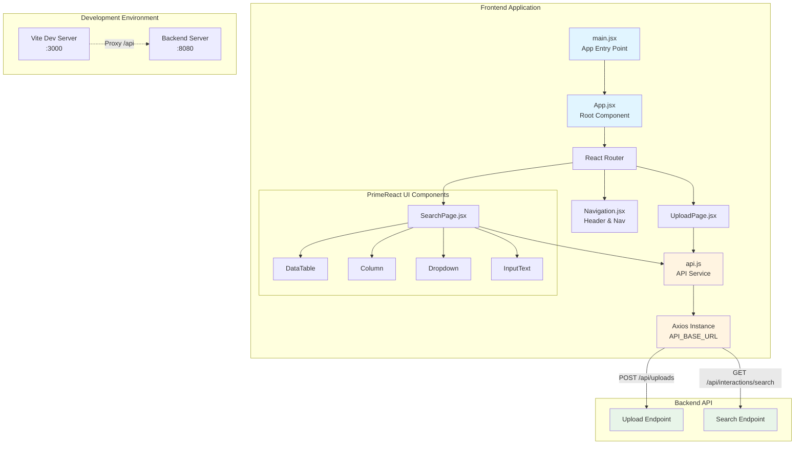
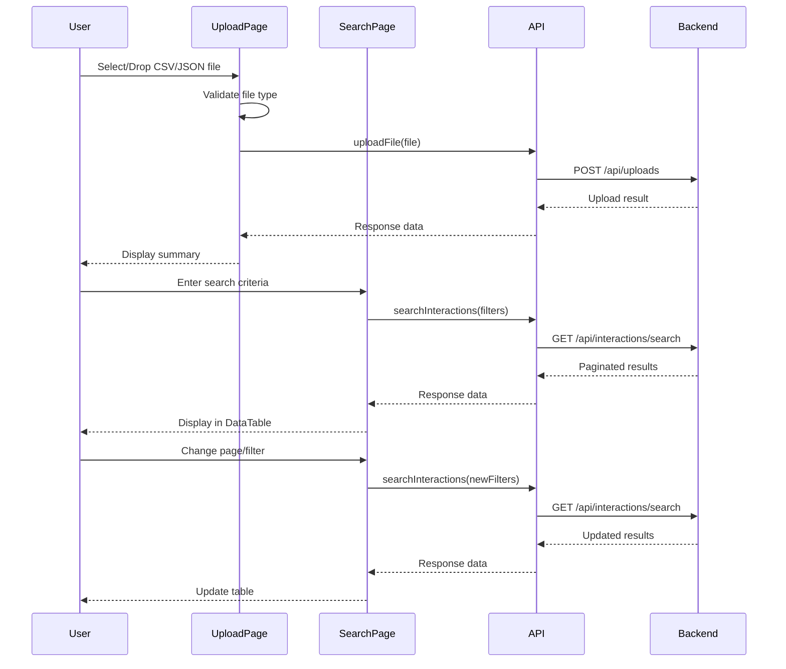

# Customer Workbench Frontend

Modern React-based frontend for the Customer Insights Workbench application. It provides a file upload UI (CSV/JSON) for customer interaction data and a search/filter UI to view interaction records.

## Architecture

### Visual Architecture Diagram



### Data Flow Architecture



### Technology Stack
- **Framework**: React 18.2
- **Build Tool**: Vite 5
- **HTTP Client**: Axios
- **Routing**: React Router v6
- **UI Components**: PrimeReact 10.9.7
- **UI Utilities**: PrimeFlex 4.0
- **Icons**: PrimeIcons 7.0
- **Date Utilities**: date-fns 2.30
- **Styling**: CSS3 with custom properties

### Project Structure
```
src/
├── components/
│   ├── Navigation.jsx       # Main navigation header
│   └── Navigation.css
├── pages/
│   ├── UploadPage.jsx       # File upload interface
│   ├── UploadPage.css
│   ├── SearchPage.jsx       # Search and filter interface
│   └── SearchPage.css
├── services/
│   └── api.js               # API communication
├── App.jsx                  # Main application component
├── App.css
├── index.css                # Global styles
└── main.jsx                 # Application entry point
```

### Key Features

#### 1. Navigation
- Header with app branding
- Navigation links to Upload and Search pages
- Active route indicator

#### 2. Upload Page
- **Drag-and-drop zone** for intuitive file selection (CSV and JSON)
- Standard file input as alternative upload method
- Client-side file validation (by MIME type and filename)
- Visual feedback for drag states (hover effects)
- Loading indicator during upload
- Success/error messages and upload summary
- Detailed format guide with CSV and JSON examples
- Upload result summary with job ID and record counts

#### 3. Search Page
- **PrimeReact DataTable** with advanced features:
  - Lazy loading and server-side pagination
  - Column-level filtering (Customer ID, Interaction Type, Feedback)
  - Sortable columns (Timestamp)
  - Configurable rows per page (5, 10, 25, 50)
  - Dropdown filters for interaction types
- Multi-criteria search form:
  - Search by Customer ID
  - Filter by Interaction Type (Email, Chat, Ticket, Feedback)
  - Filter by Date Range (start and end datetime)
- Responsive data display:
  - Formatted timestamps (locale-aware)
  - Customer ID
  - Interaction Type (with dropdown filter)
  - Feedback (truncated at 40 characters)
  - Support Response (truncated at 40 characters)
- Real-time search results with loading states
- Comprehensive error handling and user feedback
- Results summary showing total records and page info

#### 4. API Integration
- Centralized API client using axios, defined in `src/services/api.js`
- Error handling and user feedback
- Multipart form data uploads for file uploads

## Setup Instructions

### Prerequisites
- Node.js 16+ and npm/yarn

### Installation
```bash
npm install
```

### Development Server
```bash
npm run dev
```

The application will open at `http://localhost:3000` by default.

### Build for Production
```bash
npm run build
```

The build artifacts will be stored in the `dist/` directory.

### Preview Production Build
```bash
npm run preview
```

## API Integration

The frontend communicates with the backend via REST APIs:

### Upload Endpoint

POST /api/uploads (multipart/form-data)

Request body: file (binary)

Response example:
```json
{
  "success": true,
  "message": "Upload processed",
  "uploadJobId": 123,
  "processedRecords": 42,
  "failedRecords": 0
}
```

### Search Endpoint

GET /api/interactions/search?customerId=CUST-001&interactionType=email&page=0&size=10

Response example:
```json
{
  "interactions": [ /* array of interaction objects */ ],
  "totalElements": 100,
  "totalPages": 10,
  "currentPage": 0,
  "pageSize": 10
}
```

## Configuration

### Backend API URL
The project reads the backend API URL from the `VITE_API_URL` environment variable, with a fallback to `http://localhost:8080/api`:

```javascript
// src/services/api.js
const API_BASE_URL = import.meta.env.VITE_API_URL || 'http://localhost:8080/api'
```

To configure a custom backend URL, create a `.env` file in the project root:

```env
VITE_API_URL=http://your-backend-url:port/api
```

For production builds, set this environment variable in your deployment platform (Vercel, Netlify, Docker, etc.).

### CORS & Dev Proxy
Vite is configured to proxy `/api` to `http://localhost:8080` during local development (see `vite.config.js`), which avoids CORS for `/api` calls when running the dev server. When deploying the frontend separately from the backend, ensure the backend enables CORS or that you configure a reverse proxy to avoid cross-origin issues.

## UI/UX Features

### Responsive Design
- Mobile-first approach
- Adaptive layouts for different screen sizes
- Optimized table layout for small screens

### Accessibility
- Semantic HTML structure
- Proper form labels and ARIA attributes
- Keyboard navigation support

### User Feedback
- Loading spinners during async operations
- Success/error alert messages
- Disabled states for buttons during loading
- Pagination controls

### Styling
- Custom CSS properties for theming
- Consistent color scheme and spacing
- Smooth transitions and animations
- Professional badge indicators for interaction types

## Component Details

### UploadPage
- **Features**:
  - Drag-and-drop zone with visual feedback
  - File selection via file input (accessible fallback)
  - Format validation (CSV/JSON only)
  - Loading indicator with disabled state
  - Upload result summary with detailed statistics
- **State Management**: File, loading, message type, upload result, drag active state
- **Error Handling**: File type validation, API error handling with user-friendly messages
- **Accessibility**: Keyboard navigation support for dropzone (Enter/Space to select files)

### SearchPage
- **Features**:
  - PrimeReact DataTable with lazy loading
  - Multi-criteria search form (Customer ID, Interaction Type, Date Range)
  - Server-side pagination with configurable page sizes
  - Column-level filtering and sorting
  - Responsive table layout
- **State Management**: Filters (customerId, interactionType, dates, page, size), results, loading, error, search status
- **Data Display**:
  - Formatted timestamps (locale-aware date/time)
  - Truncated text for long feedback/responses (40 char limit)
  - Interactive dropdown filters for interaction types
  - Results summary with total count and page info
- **Performance**: useCallback for memoized search function to prevent unnecessary re-renders

### Navigation
- Features: Logo, navigation links, active route highlighting
- Responsive: No hamburger menu yet; mobile layout is supported but a hamburger menu can be added later

## Testing

Run tests with:
```bash
npm run test
```

## Deployment

### Vercel
1. Connect your GitHub repository to Vercel
2. Configure build command: `npm run build`
3. Configure output directory: `dist`
4. Add environment variables if needed
5. Deploy

### Docker
```dockerfile
FROM node:18-alpine as builder
WORKDIR /app
COPY package*.json ./
RUN npm install
COPY . .
RUN npm run build

FROM nginx:alpine
COPY --from=builder /app/dist /usr/share/nginx/html
EXPOSE 80
CMD ["nginx", "-g", "daemon off;"]
```

Build and run:
```bash
docker build -t customer-workbench-frontend .
docker run -p 3000:80 customer-workbench-frontend
```

## Environment Variables

Create a `.env` file in the project root to configure environment-specific settings:

```env
# Backend API URL (default: http://localhost:8080/api)
VITE_API_URL=http://localhost:8080/api

# For production deployments, set this to your production backend URL
# Example: VITE_API_URL=https://api.yourcompany.com/api
```

**Note**: Environment variables prefixed with `VITE_` are exposed to the client-side code and bundled during build. Never store sensitive credentials in these variables.

## Browser Support
- Chrome (latest)
- Firefox (latest)
- Safari (latest)
- Edge (latest)

## Performance Optimizations
- Lazy loading of routes with React.lazy (can be extended)
- Optimized CSS with custom properties
- Efficient re-renders with React hooks
- Pagination to limit data on screen

## Future Enhancements
- Advanced search with saved filters
- Export search results to CSV
- Data visualization and charts
- User authentication and authorization
- Real-time notifications
- Dark mode support
- Internationalization (i18n)
- Accessibility improvements
